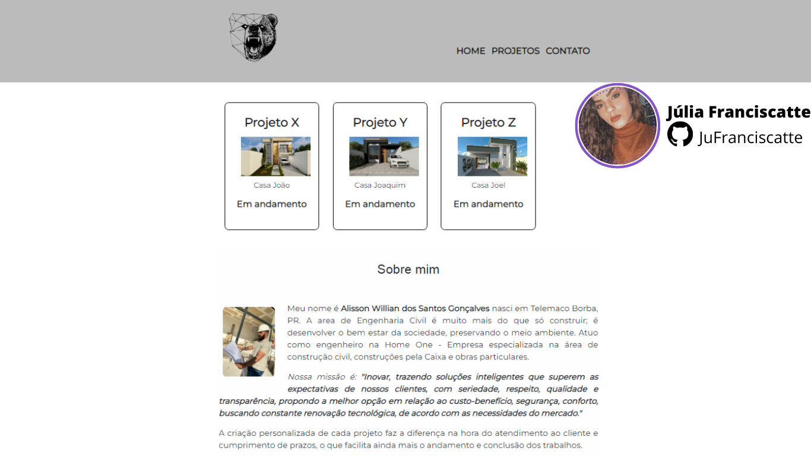

<h1 align="center"> Site | Alisson </h1>

Projeto desenvolvido para treino de tecnologias WEB.

 

  

## 🚀 Tecnologias

Esse projeto foi desenvolvido com as seguintes tecnologias:

- HTML e CSS
- Git e Github

## 💻 Projeto

O "esboço" do site foi criado para explorar e desenvolver habilidades, criatividade para agregar nos estudos e construção de portfólio.

Feito com ♥ by JúliaFranciscatte
